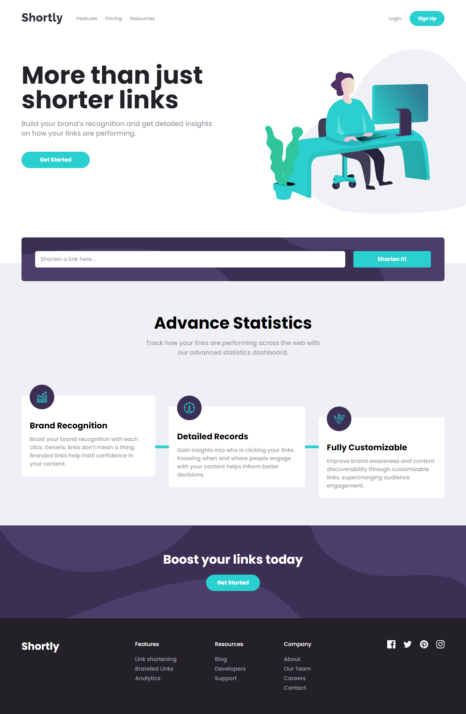

# URL Shortening API

<!-- screenshots here -->

A challenge from [frontendmentor.io](https://www.frontendmentor.io/)

## Overview

### Links

- [Live Site](https://your-live-site-url.com)
- [Solution](https://www.frontendmentor.io/profile/boedegoat)

### The challenge

- View the optimal layout for the site depending on their device's screen size
- Shorten any valid URL
- See a list of their shortened links, even after refreshing the browser
- Copy the shortened link to their clipboard in a single click
- Receive an error message when the `form` is submitted if:
  - The `input` field is empty

## My process

### Built with

- Semantic HTML5 markup
- Flexbox
- Mobile-first workflow
- Tailwind CSS
- React

### Useful Resources

1. [Figma](https://www.figma.com/) - Paste your project design mockups to check the size, colors, etc.
2. [Vite](https://vitejs.dev/) - Next Generation Frontend Tooling

## Acknowledgments

Thank you very much to everyone who gave me feedback on my solution. It greatly assists me in improving my frontend development skills.
